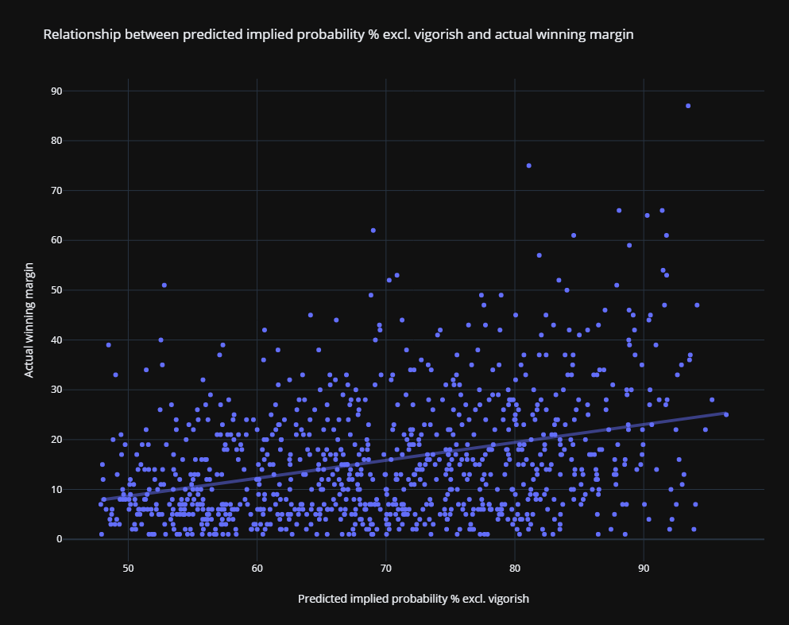

# Bet

## Disclaimer
This is just a bit of fun - I know nothing about statistics or rugby.

## TL;DR
An attempt to predict winners and winning margins for rugby matches by comparing bookmaker odds with past odds and results.

## Full Explanation
Bookmakers are in the business of calculating the most likely results of sports matches. By analysing the odds that the bookmakers publish, the strength of their conviction in each result can be inferred. The theory is that an approximate likely winning margin can be extrapolated by analysing odds data. For example, the opening match of the 2019 Rugby World Cup (Japan vs Russia), had the following average bookmaker odds:

```
Japan to win: 1.011538462
Russia to win: 28.72592593
Draw: 61
```

The numbers above can be converted into implied probabilities (IP) with the formula `IP = (1 / {decimal odds}) * 100`. The implied probability on this match is:

```
Japan to win: ~98.86%
Russia to win: ~3.48%
Draw: ~1.64%
```

These percentages haven't yet been adjusted for the bookmaker's margin (also called _vigorish_ or _overround_) which is why they add up to more than 100%. To adjust for vigorish, the formula `({IP total} / {result IP}) * 100` can be applied:

```
Japan to win: ~95.08%
Russia to win: ~1.57%
Draw: ~3.34
```

In their unrounded form, these numbers now neatly add up to exactly 100%. Given the bookmakers odds, we've calculated the implied probability of Japan's victory to be ~95.08%, which means that the bookmakers believe strongly that the Japanese will win the match.

It stands to reason that the larger the disparity in implied probability of victory for each team, the larger the margin of victory is likely to be - the best team in the tournament is likely to beat the worst team in the tournament by a higher margin than they would beat the second best team. This is useful when playing [Superbru](https://www.superbru.com), a sports prediction pool in which players predict a winner for each match as well as a margin of victory. Points are awarded for predicting the winner correctly, and further points can be earned by getting close to the winning margin.

Predicting a winner based on the bookmaker odds is trivial - just choose whoever has shorter odds. Predicting a margin is more interesting.

Below is a plot of implied probabilities and winning margins on Super Rugby matches between 2009 and 2019<sup>1</sup>:



The line plotted through the data is a linear regression function - an attempt at a line of best fit. The idea of the program is to input the bookmaker odds for a fixture, and output the most likely winning margin. For example:

```
What is the first team called?
Japan
What is the other team called?
Russia
Predicting for Japan vs Russia!
Please Enter all odds in European format (decimal), e.g. "1.23".
What are the odds on Japan to win?
1.011538462
What are the odds on Russia to win?
28.72592593
What are the odds on a draw?
61

Victory for Japan is predicted with a margin of 25.
```

The prediction is made with simple linear regression analysis of the data, which allows the program to predict a margin for a given implied probability (the independent variable), which is calculated from the inputs.

## Footnotes

<sup>1</sup> There really isn't enough data here to do perform decent statistical analysis. Bookmakers unpublish their odds when matches are over, so the odds of past fixtures are not readily available. This data is just from a spreadsheet I found - a version is available at [results.csv](src/Bet/Assets/results.csv). I have no doubt that there are more sophisticated ways to do perform better suited curve-fitting analyses on this type of data, but I don't know enough about statistics to pick one, and this is just for fun. Superbru also awards bonus points for predicting the margin _exactly_ correctly, so a rigorous prediction algorithm should weight the median margin for an implied probability against the mean to produce a number, but I'm not bothering with that. Another obvious improvement would be using odds in the winning margin market to hone in predictions, but I don't have access to historical odds data for that market.
